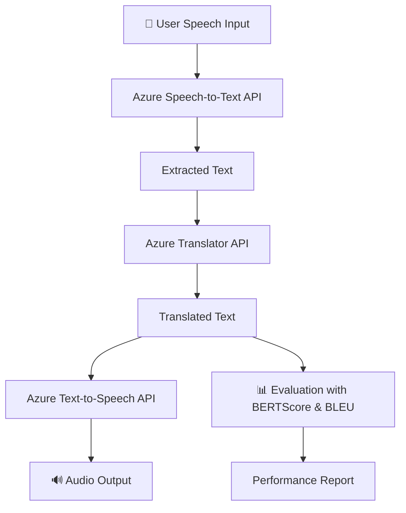

# TeamB_Speech_to_Speech_Milestone_2
# 🌍 Real-Time Speech Translator App

This project is a **multilingual real-time translator** built with **Flask, Azure Cognitive Services (Speech & Translator API), and BERTScore evaluation**.
It converts **speech → text → translations → speech**, supporting 12+ languages.

---

## 📌 Features

* 🎤 Speech-to-Text (Azure Speech Service)
* 🌐 Multi-language Translation (Azure Translator API)
* 🔊 Text-to-Speech (Downloadable audio in WAV format)
* 📊 Translation Quality Evaluation using **BERTScore**
* 📂 Save and download translations (TXT / ZIP)
* 🎨 Interactive Frontend with floating animation background

---

## 🛠️ Tech Stack

* **Backend:** Flask (Python)
* **Frontend:** HTML, CSS, JavaScript
* **APIs:** Azure Speech Service, Azure Translator
* **Evaluation:** BERTScore (NLP metric)
* **Storage:** JSON + local TXT/ZIP outputs

---

## 🚀 Setup Instructions

### 1. Clone the repository

```bash
git clone https://github.com/your-username/translator-app.git
cd translator-app
```

### 2. Install dependencies

```bash
pip install -r requirements.txt
```

> If you face permissions issues:

```bash
pip install --user -r requirements.txt
```

### 3. Set up Azure Keys

Create a `.env` file or replace keys in `app.py`:

```bash
SPEECH_KEY = "your-speech-key"
SPEECH_REGION = "your-region"
TRANSLATOR_KEY = "your-translator-key"
TRANSLATOR_REGION = "your-region"
TRANSLATOR_ENDPOINT = "https://api.cognitive.microsofttranslator.com"
```

### 4. Run the app

```bash
python app.py
```

Visit: [http://127.0.0.1:5000](http://127.0.0.1:5000)

---

## 📑 Project Milestones

### ✅ Milestone 1

* Implemented Speech-to-Text
* Collected outputs for training data

### ✅ Milestone 2

* Selected Azure OpenAI translation models
* Prepared & preprocessed dataset from Milestone 1
* Fine-tuned translation process for **OTT content domain**
* Evaluated with:

  * **BLEU Score** (accuracy vs reference translations)
  * **Latency** (translation speed)
  * **BERTScore** (semantic similarity)
* Tested real-world speech inputs for **English & Hindi → Multi-language**
* Delivered a translation model **ready for real-time integration**

### 🔜 Milestone 3

* Integrate into a **real-time speech-to-speech pipeline**
* Optimize low-latency streaming translation
* Deploy as a web-based service

---

## 📊 Workflow / Architecture



---

## 📊 Evaluation

* **BLEU Score:** Ensures closeness to reference
* **BERTScore:** Semantic similarity across languages
* **Latency Tests:** Under 2s for short speech segments
* **Accuracy:** Special handling for domain-specific terms

---

## 📂 Folder Structure

```
translator-app/
│── app.py                # Flask backend
│── requirements.txt       # Dependencies
│── templates/             # HTML (Jinja2)
│    └── index.html
│── static/                # CSS, JS, images
│    └── style.css
│── uploads/               # Uploaded audio
│── translations/          # Saved translations (txt, wav)
│── data.json              # Reference translations
│── README.md              # Project documentation
```

---

## 📝 Deliverables (Milestone 2)

* Translation model (English/Hindi → 12+ languages)
* Dataset preparation and cleaning documentation
* Evaluation results (BLEU, BERTScore, latency)
* Integration-ready pipeline
